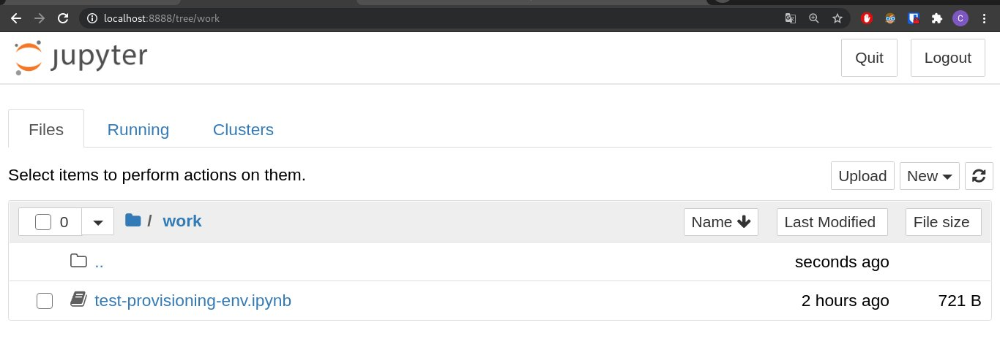

# elixir-playground

- __Data__: 15/11/2020;
- __Autor__: [@augustoliks](https://github.com/augustoliks) | <carlos.santos110@fatec.sp.gov.br>;
- __Descrição__: Ambiente provisionado com docker-compose, contendo Jupyter-Notebook que expõem códigos Elixir;
- __Objetivo__: Fixar e descrever o entendimento sobre os recursos da Linguagem Elixir;
- __Funcionalidades__:
    - docker-compose com o ambiente jupyter-notebook com Kernel Elixir configurado.

## Depêndencias

Depêndencia     | Versão    | Descrição
:---:           |:---:      |:---:
docker          | 19.03.8   | Gerenciador de Containers
docker-compose  | 1.25.4    | Orquestrador de Containers

## Estrutura do Projeto

```shell
├── docker-compose.yml  # Compose do projeto
├── exercicies          # Códigos Elixir, executados no terminal
│   ├── 01-hello-world.exs
│   └── ...                 
└── jupyter-notebook    # Jupyter-Notebooks 
    ├── test-provisioning-env.ipynb
    └── ...
```

## Configuração do Ambiente Jupyter

```bash
$ git clone https://github.com/augustoliks/elixir-playground.git
$ cd elixir-playground/
$ docker-compose up -d 

    Creating network "elixir-playground_default" with the default driver
    Creating jup-notebook ... done
```

Para acessar o ambiente Web do Jupyter, é necessário um token de acesso. Este é gerado no momento do _build_ da Imagem. A cada `build` da imagem, é gerado um novo Token. Para obter este Token, com o container operante, executar:

```bash
$ docker logs jup-notebook 
```

A saída do comando, irá conter o link de acesso ao ambiente Web do Jupyter, com o token incluso.

```
$ docker logs jup-notebook 
...
     Copy/paste this URL into your browser when you connect for the first time,
    to login with a token:
        http://localhost:8888/?token=267cbe9bc6673475720b2554c7ff1ad996814a3219006eae&token=267
```

> No exemplo, a URL de acesso para o Jupyter é: http://localhost:8888/?token=267cbe9bc6673475720b2554c7ff1ad996814a3219006eae&token=267 

Ao acessar o ambiente web, verá dois diretórios.


O diretórios `works` está vinculado como volume ao diretório [jupyter-notebook](./jupyter-notebook), presente no diretório deste projeto. 



Tudo que for salvo no diretório works, estará sendo salvo em [jupyter-notebook](./jupyter-notebook).

## Progresso

Para acessar o contéudo criado no formato Jupyter Notebook, basta clicar nos links abaixo. 
                                                                                                        
- TODO: [1-introduction](jupyter-notebook/TODO/1-introduction.ipynb)
- TODO: [2-basic-types](jupyter-notebook/TODO/2-basic-types.ipynb)
- TODO: [3-basic-operators](jupyter-notebook/TODO/3-basic-operators.ipynb)
- [4-pattern-matching](jupyter-notebook/4-pattern-matching.ipynb)
- TODO: [5-case-cond-and-if](jupyter-notebook/TODO/5-case-cond-and-if.ipynb)
- TODO: [6-binaries-strings-and-charlists](jupyter-notebook/TODO/6-binaries-strings-and-charlists.ipynb)
- TODO: [7-keyword-lists-and-maps](jupyter-notebook/TODO/7-keyword-lists-and-maps.ipynb)
- TODO: [8-modules-and-functions](jupyter-notebook/TODO/8-modules-and-functions.ipynb)
- TODO: [9-recursion](jupyter-notebook/TODO/9-recursion.ipynb)
- TODO: [10-enumerables-and-streams](jupyter-notebook/TODO/10-enumerables-and-streams.ipynb)
- TODO: [11-processes](jupyter-notebook/TODO/11-processes.ipynb)
- TODO: [12-io-and-the-file-system](jupyter-notebook/TODO/12-io-and-the-file-system.ipynb)
- TODO: [13-alias-require-and-import](jupyter-notebook/TODO/13-alias-require-and-import.ipynb)
- TODO: [14-module-attributes](jupyter-notebook/TODO/14-module-attributes.ipynb)
- TODO: [15-structs](jupyter-notebook/TODO/15-structs.ipynb)
- TODO: [16-protocols](jupyter-notebook/TODO/16-protocols.ipynb)
- TODO: [17-comprehensions](jupyter-notebook/TODO/17-comprehensions.ipynb)
- TODO: [18-sigils](jupyter-notebook/TODO/18-sigils.ipynb)
- TODO: [19-try-catch-and-rescue](jupyter-notebook/TODO/19-try-catch-and-rescue.ipynb)
- TODO: [20-typespecs-and-behaviours](jupyter-notebook/TODO/20-typespecs-and-behaviours.ipynb)
- TODO: [21-debugging](jupyter-notebook/TODO/21-debugging.ipynb)
- TODO: [22-erlang-libraries](jupyter-notebook/TODO/22-erlang-libraries.ipynb)
- TODO: [23-where-to-go-next](jupyter-notebook/TODO/23-where-to-go-next.ipynb)

## Referências

- https://elixir-lang.org/getting-started/introduction.html
- https://github.com/pprzetacznik/IElixir
